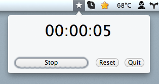

# Status Bar Timer for OSX

### Features

 * Multiple project can be configured in `~/.timerprojects` (project names separated by newlines).
 * Save/restore timer values for each project on quit/relaunch.
 * Stores log file with start/stop times.

### Credits

The code is based on [Vadim Shpakovski's Popup window example project on GitHub](https://github.com/shpakovski/Popup).

Licensed under the terms of the BSD License (see LICENSE file).

Sebastian Volland - http://github.com/sebcode